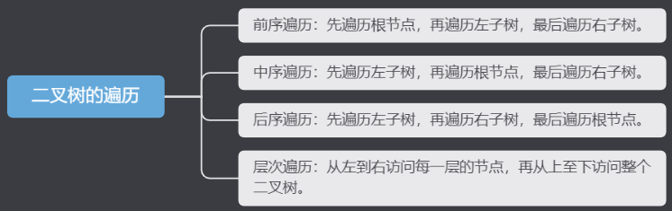
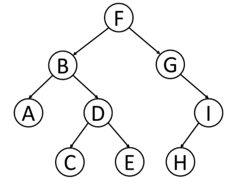

### 二叉树的遍历

***

遍历方式

***

示例二叉树：

***

####  前序遍历

先访问根节点，再遍历左子树，最后遍历右子树。进而达到访问整个二叉树的效果。

前序遍历访问示例二叉树的过程：

- 首先访问以 F 为根节点的二叉树，
  - 先读取 F 节点的全部信息
  - 遍历 F 的左子树，左子树是以 B 为根节点的二叉树
    - 读取根节点 B 的全部信息
    - 遍历 B 的左子树：以 A 为根节点的二叉树，因为 A 是叶子节点，没有子节点，所以 以 A 为根节点的二叉树遍历完成。
    - 遍历 B 的右子树：以 D 为根节点的二叉树
      - 读取根节点 D 的全部信息
      - 访问 D 的左子树：以 C 为根节点的二叉树。因为 C 是叶子节点，没有子节点，所以 以 C 为根节点的二叉树遍历完成
      - 访问 D 的右子树：以 E 为根节点的二叉树。因为 E 是叶子节点，没有子节点，所以 以 E 为根节点的二叉树遍历完成
  - 遍历 F 的右子树，右子树是以 G 为根节点的二叉树
    - 读取根节点 G 的全部信息
    - 遍历 G 的左子树：左子树为空
    - 遍历 G 的右子树：右子树是以 I 为根节点的二叉树
      - 读取根节点 I 的全部信息
      - 遍历 I 的左子树：以 H 为根节点的二叉树，因为 H 是叶子节点，没有子节点，所以 以 H 为根节点的二叉树遍历完成
      - 遍历 I 的右节点：右子树为空

遍历结果：F -> B -> A -> D -> C -> E -> G -> I -> H

***

中序遍历

先访问左子树，再访问根节点，最后访问右子树。进而达到访问整个二叉树的效果

访问以 F 为根节点的二叉树

-  先访问 F 的左子树：以 B 为根节点的二叉树。
  - 访问 B 的左子树 ： 以 A 为根节点的二叉树。因为 A 是叶子节点，所以直接读取 A 节点的全部信息。以 A 为根节点的二叉树遍历完成。
  - 访问根节点 B 的全部信息
  - 访问 B 的右子树：以 D 为根节点的二叉树
    - 访问 D 的右子树：以 C 为根节点的二叉树。因为 C 节点是叶子节点，所以直接访问 C 节点的全部信息。以 C 为根节点的二叉树遍历完成。
    - 读取根节点 D 的全部信息
    - 访问 D 的左子树: 以 E 为根节点的二叉树。因为 E 节点是叶子结点，所以读取 E 节点的全部信息。以 E 为根节点的二叉树遍历完成。
- 读取根节点 F 的全部信息
-  访问 F 的右子树：以G为根节点的二叉树。
   - G 的左子树为空
   - 读取根节点 G 的全部信息
   -  访问 G 的右子树：以 I 为根节点的二叉树
      - 访问 I 的右子树：以 H 为根节点的二叉树。因为 H 为叶子结点，所以直接读取 H 节点的全部信息。以 H 为根节点二叉树访问完毕
      - 读取 I 节点的全部信息
      - I 的右子树为空

遍历结果：A -> B -> C -> D -> E -> F -> G ->H -> I

***

后序遍历

访问 以 F 为根节点的二叉树：

- 访问 F 的 左子树：以 B 为根节点的二叉树
  - 访问 B 的左子树：以 A 为根节点的二叉树。因为 A节点为叶子结点，所以直接读取 A 节点的全部信息。以 A 为根节点二叉树遍历完成
  - 访问 B 的右子树：以 D 为根节点的二叉树
    - 访问 D 的左子树：以 C 为根节点的二叉树。因为 C 节点为叶子结点，所以直接读取 C 的全部信息，以 C 为根节点二叉树遍历完成
    - 访问 D 的 右子树：以 E 为根节点的二叉树。因为E 节点为叶子结点，所以直接读取 E 的全部信息，以 E 为根节点二叉树遍历完成
    - 读取 D 的全部信息
  - 访问 B 节点的全部信息
- 访问 F 的右子树：以 G 为根节点的二叉树
  - G 的左子树为空
  - 访问 G 的右子树：以 I 为根节点的二叉树
    - 访问 I 的左子树：以 H 为根节点的二叉树。因为 H 节点为叶子结点，所以直接读取 H 节点的全部信息。以 H 为根节点二叉树遍历完成
    - I 的右子树为空
    - 读取 I 节点的全部信息
  - 读取 G 节点的全部信息

遍历结果：A -> C -> E -> D -> B -> H -> I -> G ->  F